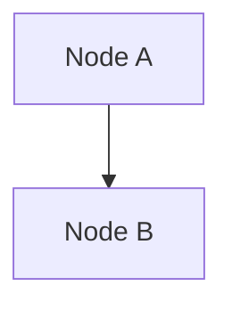

# Workflow README Template

Copy this file as the `README.md` inside every workflow folder
(e.g. `n8n/<workflow-slug>/README.md`). Keep the section order — it is the
case-study format clients read.

## Section order (frozen — do not reorder, rename, or drop)

`The problem` → `The solution` → `Stack & credentials` → `Setup` →
`Verification` → `Reliability & error handling` → `Results & impact` →
`Sanitization notes` → CTA line.

- `Why it's different` is **not** a section anymore — fold that content
  into `The solution`.
- `Customize` is **optional**: include it only where the workflow exposes
  safe knobs, placed after `Setup`.

## Folder contract

```
<workflow-slug>/
├── workflow.json        # Platform artifact (n8n export, config, script)
├── .env.example         # Credentials/config placeholders (no secrets, ever)
├── README.md            # This template
├── SETUP.md             # Optional step-by-step guide
└── assets/
    ├── diagram.svg      # archify-rendered architecture diagram — required
    └── diagram.json     # archify candidate (source of the SVG)
```

The diagram is rendered with [archify](https://github.com/tt-a1i/archify)
(workflow type, showcase quality, all gates green). Keep `diagram.json` in
the folder so the SVG can be regenerated after changes.

All visuals follow the repo's shared design language —
[`docs/visual-style.md`](visual-style.md) ("Paper" theme: light canvas,
semantic pastel colors, mono type). Never hand-edit generated assets.

---

```markdown
# <Workflow Name>

**Platform:** n8n · **Category:** <Lead Ops / Support / Data / Content>
**Outcome:** <one-line result — no invented numbers>


*Architecture diagram — source [`assets/diagram.json`](assets/diagram.json),
rendered with [archify](https://github.com/tt-a1i/archify)*

**Node graph** — generated from `workflow.json` (see
`scripts/render-mermaid.py`; regenerate after changing the workflow):

<!-- mermaid:start -->

<!-- mermaid:end -->

## The problem

<2–3 sentences: who has this problem, how much time/money it costs>

## The solution

<Architecture diagram + description of the flow — including what used to
be "Why it's different": the design choices that make it more than a
connect-A-to-B zap>

## Stack & credentials

<Node list, required APIs, env vars — see `.env.example`>

## Setup

<import → configure → activate>

## Customize *(optional — only where the workflow has safe knobs)*

<editable rules, thresholds, config-sheet cells>

## Verification

<what a demo-lane run proves: item counts, branch coverage, PASS>

## Reliability & error handling

<Document only what workflow.json actually does — name the real nodes;
omit (never pad) mechanisms that don't exist>

## Results & impact

<Evidence: repo-verifiable numbers promoted from Verification. Business
outcomes: owner-supplied only — `<!-- owner-metric: ... -->` placeholders,
never guesses>

## Sanitization notes

<What was stripped from the export — publish this sentence only after the
exports are actually clean (credentials, instance identifiers, pinned
data removed)>

---

*Need something like this for your business?
[Contact me](../../README.md#hire-me)*
```
