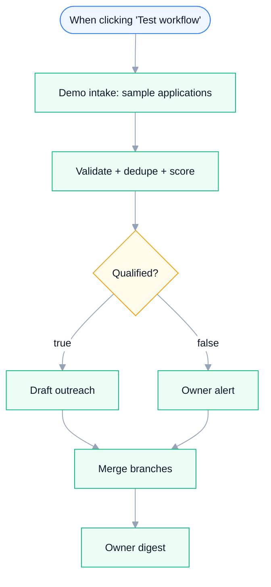

# Affiliate Intake — Application Screening & Outreach Drafting

**Platform:** n8n · **Category:** Marketing / Partner Ops
**Outcome:** Every application screened against your own rules — qualified
applicants get a personalized outreach draft, the rest get a reason-coded
alert, and you get exactly one digest per run.

*Architecture diagram — source [`assets/diagram.json`](assets/diagram.json), rendered with [archify](https://github.com/tt-a1i/archify)*

**Node graph** — generated from `workflow.json` (see `scripts/render-mermaid.py`):

<!-- mermaid:start -->

<!-- mermaid:end -->

## The problem

Affiliate and ambassador programs attract a steady trickle of applications —
some great, most not. Reading each one by hand doesn't scale, but
auto-accepting everyone dilutes the program.

## The solution

Screens applications end-to-end: dedupes by email, sanity-checks
self-reported metrics, scores fit against an **editable RULES block**
(accepted platforms, minimums, fit threshold), then routes each applicant —
qualified → personalized outreach draft; rejected → owner alert with the
reason. A Merge node guarantees the owner digest ("N qualified, M alerts")
fires exactly once.

## Stack & credentials

13 nodes — Code, IF, Merge, Manual Trigger, Sticky Notes.
**Zero credentials required** — no node makes an external call, and the demo
intake emits six sample applications covering every branch (missing email,
implausible metrics, duplicate, below threshold). `.env.example` exists only
to complete the folder contract; there is nothing to fill in.

## Setup

~2 minutes. Import `workflow.json`, click **Test workflow** — the demo runs
end-to-end on import.

**To go live:** swap the demo intake for a real form (n8n Form Trigger,
Tally/Typeform webhook) emitting the same item shape; add Gmail/Slack after
the outreach/alert/digest nodes.

## Customize

All screening logic lives in the editable `RULES` constant at the top of
`Validate + dedupe + score` — no other node needs touching:

- `accepted_platforms` — which platforms count toward fit (default:
  instagram, tiktok, youtube)
- `min_followers`, `min_engagement_rate` — the floors the score is
  normalized against
- `min_posts_for_claimed_reach` — sanity bound: a claimed audience with
  fewer posts than this is rejected as implausible
- `min_fit_score` — the 0–100 threshold an applicant must reach

## Verification

Verified in a clean n8n container (`n8n:latest`, Docker): imports clean,
all four edge cases exercised, zero credentials attached, demo data uses
placeholder addresses only.

### Run it yourself

The bundled demo batch is the fastest way to see it run — click **Test
workflow** after import. The documented input contract and the expected
verdict per sample live in
[`examples/affiliate-intake/`](../../examples/affiliate-intake/)
([`test-data.json`](../../examples/affiliate-intake/test-data.json)).

## Reliability & error handling

This workflow makes **no external calls at all** — every node is Code, IF,
Merge, Manual Trigger or Sticky Note — so there is nothing to retry, no
credential to expire and no network failure surface. The mechanisms that
exist are deterministic in-run logic:

- **Dedupe by email** — `Validate + dedupe + score` keeps a `seen` set per
  run; a repeat address is rejected as `duplicate of <email>` instead of
  being processed twice (in-run idempotency).
- **Sanity-check of self-reported metrics** — the same node rejects
  non-numeric or negative metrics, `engagement_rate` outside 0–100, and
  implausible reach (claimed followers with fewer than
  `min_posts_for_claimed_reach` posts).
- **Reason-coded rejection — no silent drops** — `Qualified?` routes every
  failed applicant to `Owner alert`, which emits the exact `reject_reason`
  (missing field / duplicate / implausible metrics / below threshold). The
  failure path is a first-class output.
- **Exactly one digest per run** — `Merge branches` joins both branches
  before `Owner digest` (`runOnceForAllItems`), so the owner summary fires
  once per run, not once per branch or per item.
- **Deterministic scoring** — fit score is pure arithmetic on the editable
  `RULES` block: same input, same verdict, every run.

Absent by design, stated honestly: no `retryOnFail`/`maxTries` (nothing to
retry), no Error Trigger / error workflow, and no live-vs-demo gate — there
are no live nodes; the demo intake is itself a Code node. Any runtime error
surfaces in n8n's execution list.

## Results & impact

**Evidence (repo-verifiable):**

| What | Result |
|---|---|
| Import on `n8n:latest` (Docker) | Clean, zero credentials attached |
| Demo batch | 6 sample applications emitted by `Demo intake: sample applications` |
| Edge cases exercised in one run | 4 — missing email, implausible metrics, duplicate, below threshold |
| Demo-run outcome | 2 qualified drafts, 4 reason-coded alerts, exactly 1 owner digest |
| Credentialed nodes | 0 of 13 — runs end-to-end with no setup |

**Business outcome (owner-supplied):**

<!-- owner-metric: applications screened per month, or hours saved vs manual review -->

## Sanitization notes

Sanitized for public sharing: instance identifiers (`meta.instanceId`,
workflow `id`/`versionId`) were stripped from the export before publishing.
The workflow has never contained credentials, pinned data or webhook IDs —
it makes no external calls and has no webhook nodes — so what remains is the
complete node graph, connections and settings, importable as-is.

---

*Need something like this for your business?
[Contact me](../../README.md#hire-me)*
