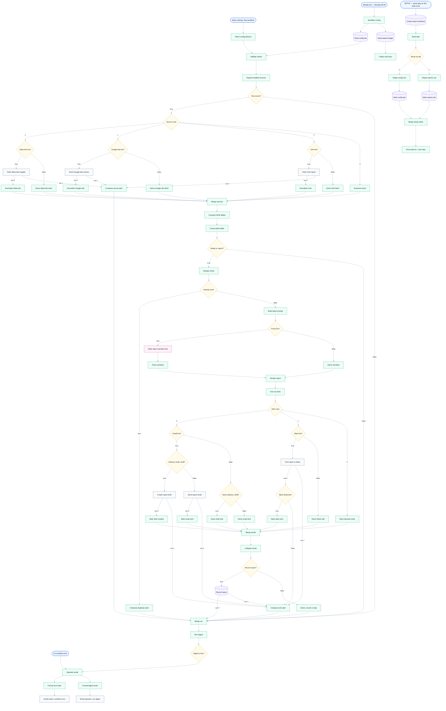

# Client Report Generator — Weekly Per-Client Reports from One Config Sheet

**Platform:** n8n · **Category:** Marketing / Agency Reporting
**Outcome:** Meta Ads + Google Ads + GA4 → week-over-week deltas →
AI-written branded report, delivered per client through Gmail and/or
Slack — driven entirely by spreadsheet cells, not workflow edits.

*Architecture diagram — source [`assets/diagram.json`](assets/diagram.json), rendered with [archify](https://github.com/tt-a1i/archify)*

**Node graph** — generated from `workflow.json` (see `scripts/render-mermaid.py`):

<!-- mermaid:start -->

<!-- mermaid:end -->

## The problem

Agencies and freelancers write the same per-client marketing report every
week: pull metrics from three ad platforms, compute deltas, write the
summary, format it, send it. Existing tools charge $20–700/month per seat;
typical templates hardcode one client per workflow.

## The solution

Every Monday it reads a `config` Google Sheet — **one row per client, one
yes/no cell per source and per delivery channel** — then:

- Fetches **Meta Ads, Google Ads and GA4** behind one adapter contract
  (a named extension dock takes new sources without touching the engine)
- Computes WoW deltas **deterministically in a Code node** — the AI only
  writes prose around finished numbers, never invents them
- Renders a **per-client branded HTML report** (`brand_name`/`brand_color`/
  `brand_logo_url` cells)
- **`delivery_mode=draft`** files a Gmail draft for owner sign-off — a
  human review seam no incumbent template offers
- **`alert_threshold_pct`** flags metrics crossing each client's band in
  the report body and counts them in the run digest
- **Idempotent `reports` ledger** keyed on `client_id + ISO week` —
  re-runs in the same week are skipped as duplicates, never double-sent
- **Per-source failure isolation** — one bad fetch alerts without blocking
  other clients; instance-level Error Trigger emails the owner on
  unhandled failures
- One-click SETUP lane provisions the workbook and prints the ID

## Stack & credentials

87 nodes — Google Sheets, Gmail, Slack, OpenAI, HTTP Request (Meta/GA4/
Slack via Header Auth, Google Ads via Custom Auth for its two-header
requirement). Works on n8n Cloud — no env vars needed.

Credentials for production: Gmail, Google Sheets, OpenAI, plus provider
tokens on the HTTP nodes. **Test workflow runs a four-client demo with
zero credentials.** See [SETUP.md](SETUP.md).

## Why it's different

| Typical report template | This workflow |
|---|---|
| Hardcoded params per client | One `config` sheet row per client — cells toggle everything |
| One ad provider | Three sources behind one adapter contract + extension dock |
| LLM summarizes raw payload | Code computes deltas; AI writes prose only |
| Append-only or no ledger | Idempotent upsert — re-runs never double-send |
| One bad fetch kills the run | Per-source alerts; other clients still report |
| Send-only | `delivery_mode=draft` review seam |
| Fixed layout | Per-client branded HTML from config cells |

## Verification

- Container pilot on `n8n:latest` (zero credentials): digest exactly 1
  item, 16 happy-path items, missing-data/duplicate/failure alerts 3/3 —
  PASS
- Fixture-driven: three config variants replay the same workflow with
  different config cells — pinned deltas verified (per-client sources,
  pause/skip, draft routing, anomaly flags)
- Slack delivery gated on the API `ok` flag — the ledger never records an
  undelivered report

---

*Need something like this for your business?
[Contact me](../../README.md#hire-me)*
