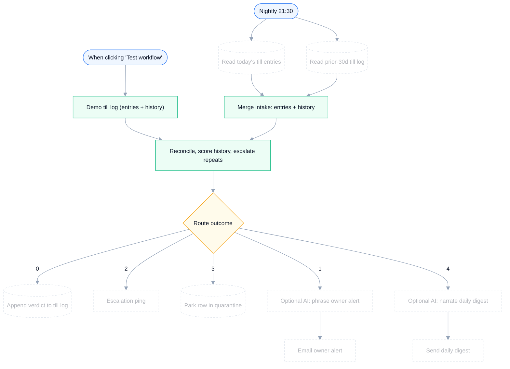

# Daily Cash Tally — Till Cash-Leak Monitor with Escalation

**Platform:** n8n · **Category:** Operations / Finance
**Outcome:** Not just "was today short" — it catches the drawer that comes
up short *every week*, and escalates it to a different channel.

*Architecture diagram — source [`assets/diagram.json`](assets/diagram.json), rendered with [archify](https://github.com/tt-a1i/archify)*

**Node graph** — generated from `workflow.json` (see `scripts/render-mermaid.py`):

<!-- mermaid:start -->

<!-- mermaid:end -->

> An earlier zero-credential version exists in git history — this is the
> production-shaped rebuild with real service nodes and cross-run state.

## The problem

A single over-tolerance night is a blip. The real leak is a pattern: same
staff, same shift, same small shortfall — invisible if every alert looks
identical. Meanwhile malformed entries silently drop, and nobody notices
the days that were never submitted at all.

## The solution

A production-shaped reconciliation pipeline with five routed outcomes:

- **30-day history scoring** — each discrepancy is scored against the prior
  month's log, so repeat offenses escalate instead of arriving as yet
  another routine alert
- **First offense** → email the owner; **repeat offender** → Telegram
  escalation
- **Quarantine lane** — malformed or duplicate rows park in a quarantine
  sheet for reprocessing instead of dropping silently
- **Gap detection** — infers unsubmitted days from sequence gaps
- **One digest per run** carrying the cumulative 30-day leak total
- **Optional AI phrasing** — two disabled OpenAI nodes write the alert
  wording and narrate the digest; the deterministic logic stays in charge
  of every verdict

## Stack & credentials

20 nodes — Google Sheets, Gmail, Telegram, Switch, Merge, Schedule Trigger,
optional OpenAI.

**Zero credentials for the demo**: the Sheets/Gmail/Telegram nodes ship
disabled and pass demo data through untouched — the workflow runs
end-to-end before you connect anything.

## Setup

1. Import `workflow.json`, click **Test workflow** — demo covers every
   branch: clean shift, escalated repeat offender, duplicate, missing
   `counted_cash`, three-day submission gap.
2. To go live: a Google Sheet as the till log (tabs: `today`, `history`,
   `results`, `quarantine`), Gmail for first-offense alerts, Telegram for
   escalations/digest. Enable the greyed-out nodes and attach credentials.
3. Optional: attach an OpenAI credential and enable the two AI phrasing
   nodes.

## Customize

Edit the `RULES` block in Reconcile — `tolerance_abs`, `tolerance_pct`,
`escalate_after`, `history_days`, `currency`. Swap Gmail/Telegram for SMS
(Twilio) or Slack; point quarantine at a ticketing tool.

## Verification

Verified in a clean n8n container (`n8n:latest`): imports clean, all edge
cases exercised, zero credentials attached, identifiers are placeholders.

---

*Need something like this for your business?
[Contact me](../../README.md#hire-me)*
