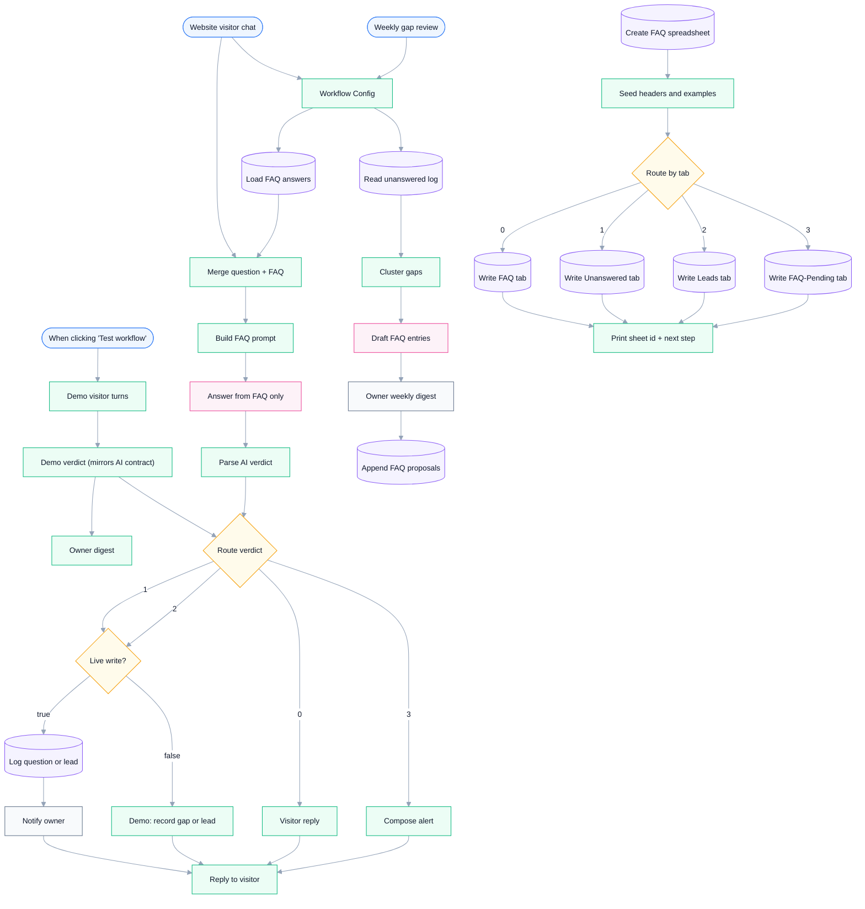

# FAQ Chatbot — Answers Visitors and Grows Its Own FAQ (With Approval)

**Platform:** n8n · **Category:** AI / Customer Support
**Outcome:** A public chatbot that answers only from your FAQ — and turns
every unanswered question into next week's better FAQ, but only after you
approve it.

*Architecture diagram — source [`assets/diagram.json`](assets/diagram.json), rendered with [archify](https://github.com/tt-a1i/archify)*

**Node graph** — generated from `workflow.json` (see `scripts/render-mermaid.py`):

<!-- mermaid:start -->

<!-- mermaid:end -->

## The problem

Most FAQ bots answer what they know and silently drop the rest. The gaps
never get fixed, and "self-learning" bots that auto-publish AI answers are
a brand risk.

## The solution

Two interlocking lanes plus a human gate:

- **Lane A — live chat:** a hosted Chat Trigger webchat; the model answers
  strictly from your Google Sheet FAQ (strict-JSON verdict, never
  improvising). Each turn routes: answered → instant reply; unanswered →
  logged to `Unanswered` and emailed to you; visitor leaves an email →
  captured to `Leads`; AI parse failure → alert path that still replies
  gracefully.
- **Lane B — weekly learning loop:** every Monday, clusters the unanswered
  log by frequency, has AI draft candidate FAQ entries, emails you the
  proposals, and appends them to `FAQ-Pending`. **You copy approved rows
  into `FAQ` — the bot only learns what you sign off.**
- **Lane C — demo:** Test workflow runs six visitor turns covering every
  route with zero credentials.
- **Lane D — one-click setup:** provisions the whole Google Sheet (4 tabs,
  headers, example rows) and prints the `spreadsheet_id` to paste once.

## Stack & credentials

40 nodes — Chat Trigger, OpenAI ×2, Google Sheets ×8, Gmail ×2, Schedule &
Manual Triggers, Switch, Code.

Production needs Google Sheets + Gmail + OpenAI credentials. The demo lane
needs none. See [SETUP.md](SETUP.md) for the step-by-step guide (~5 min).

## Why it's different

| Typical FAQ template | This workflow |
|---|---|
| Answers from KB, drops misses | Misses are logged, clustered, drafted into new FAQ entries |
| Auto-saves AI answers | Owner-approved write-back — no unprompted self-learning |
| Lead capture as an afterthought | Lead detection is a first-class route |

## Verification

Container pilot on `n8n:latest` (zero credentials): digest exactly 1 item,
6 happy-path items, empty-message / duplicate / bad-AI branches all
verified — PASS.

---

*Need something like this for your business?
[Contact me](../../README.md#hire-me)*
