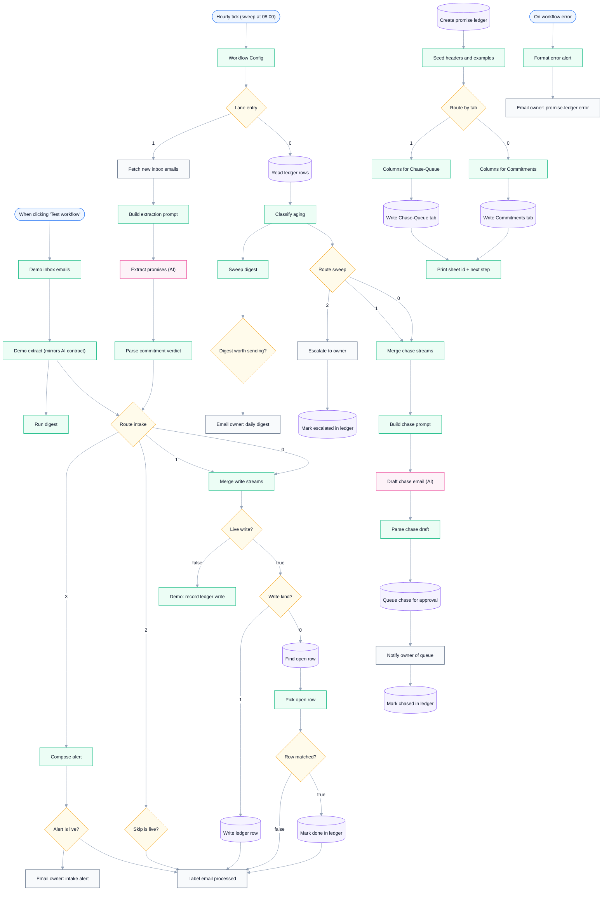

# Promise Ledger — Track Promises Made to You, Chase Before They Go Cold

**Platform:** n8n · **Category:** Founder Ops / Follow-up
**Outcome:** "I'll send it Friday" stops disappearing. Every promise lands
in a ledger, drafts its own chase email, and closes itself when the person
delivers.

*Architecture diagram — source [`assets/diagram.json`](assets/diagram.json), rendered with [archify](https://github.com/tt-a1i/archify)*

**Node graph** — generated from `workflow.json` (see `scripts/render-mermaid.py`):

<!-- mermaid:start -->

<!-- mermaid:end -->

## The problem

People promise you things over email — documents, payments, intros — and
then go quiet. Tracking them means digging through your inbox; chasing them
means remembering who owes what, and for how long.

## The solution

- **Hourly intake** reads your inbox and extracts every concrete promise
  (who, what, due when — relative dates like "by Thursday" resolve
  correctly) into a Google Sheets `Commitments` ledger with live status:
  `open → reminded → chased → escalated → done`.
- **08:00 daily sweep** classifies open promises: due today → gentle
  reminder draft; overdue → firmer follow-up; 3+ days overdue → escalates
  straight to you.
- **Approval gate** — drafts land in a `Chase-Queue` tab; you approve
  before anything sends, so the automation can never embarrass you with a
  wrong chase.
- **Fulfillment detection** — when the person finally delivers, their
  reply closes the ledger row automatically.
- **Per-person aging digest** — see at a glance who habitually leaves
  commitments hanging.
- **One-click setup lane** provisions the spreadsheet itself.

Most "commitment tracker" templates scan your *sent* mail to track promises
*you* made. This one works the inbound direction — promises made *to* you —
and adds the missing half: outbound chasing with an approval gate,
fulfillment detection, and per-person aging.

## Stack & credentials

56 nodes — Google Sheets (×10), Gmail (×6), OpenAI (×2, `gpt-4o-mini`),
Switch, Merge, Schedule Trigger, Code.

Production needs Gmail + Google Sheets + OpenAI credentials — service and
credential types are enumerated in [.env.example](.env.example). The demo
lane needs none. See [SETUP.md](SETUP.md) (~5 min).

## Setup

1. Import `workflow.json`, attach the three credentials (Gmail OAuth2,
   Google Sheets OAuth2, OpenAI API key).
2. Press play once on `Create promise ledger` — the setup lane builds a
   **Promise Ledger — Follow-ups** spreadsheet with `Commitments` and
   `Chase-Queue` tabs, headers and example rows, and
   `Print sheet id + next step` outputs the `spreadsheet_id`.
3. Open `Workflow Config` (the only node you edit) and paste `sheet_id`,
   `label_id` — the ID of a Gmail label named `promises-processed` — and
   `owner_email`. Every Sheets and Gmail node reads from this node.
4. Delete the setup lane, press **Test workflow** once to watch the demo
   run offline, then set the workflow **Active**. Intake runs every hour;
   `Lane entry` routes the 08:00 tick (workflow timezone) to the chase
   sweep.

Full walkthrough: [SETUP.md](SETUP.md).

### Run it yourself (zero credentials)

Press **Test workflow** after import — `Demo inbox emails` fires six
sample emails and `Demo extract (mirrors AI contract)` emits the same
verdicts the live AI contract returns, so every intake route runs with no
credentials: a clear commitment, a newsletter that gets skipped, a vague
promise with no due date, a duplicate, an unparseable AI answer, and a
fulfillment reply.

The documented input contract — the fields each sample carries and the
verdict it should produce — lives in
[`examples/promise-ledger/`](../../examples/promise-ledger/)
([test-data.json](../../examples/promise-ledger/test-data.json)). The
one-click demo lane is the primary way to run it; the fixture documents
the shape — there is no trigger to repoint at a file.

## Verification

Container pilot on `n8n:latest` (zero credentials): digest 1 item, happy
path 5 items, missing-data/duplicate/failure alerts 3/3 — PASS. Live OpenAI
extraction verified against a real key: relative due dates resolved,
newsletters skipped, fulfillment replies close the right ledger row.

## Reliability & error handling

- **Retries on every external call:** all 19 credentialed nodes — every
  Google Sheets (×10), Gmail (×6) and OpenAI (×2) node — ship with
  `retryOnFail: true`, `maxTries: 3`, `waitBetweenTries: 1500`.
- **Live vs demo isolation:** three `$json.live` IF gates — `Live write?`,
  `Skip is live?`, `Alert is live?` — keep demo items away from every
  external write; the demo code nodes set `live: false`, so the demo lane
  reaches zero credentialed nodes.
- **Idempotent ledger writes:** `Write ledger row` and
  `Queue chase for approval` use `appendOrUpdate` matched on `dedupe_key`
  (a person+promise hash) — a repeated promise updates its row instead of
  duplicating it, and a re-chase updates the queue draft rather than
  stacking a second one.
- **Write-before-label idempotency:** `Label email processed` applies the
  `promises-processed` label only *after* a successful ledger write, and
  `Fetch new inbox emails` excludes labelled mail. `Write ledger row` and
  `Mark done in ledger` run with `onError: continueErrorOutput` — a failed
  write never reaches the label, so the unlabelled email is re-scanned on
  the next hourly tick instead of being lost.
- **Deterministic AI fallback:** `Parse commitment verdict` strict-parses
  the model's JSON — an unparseable verdict or a missing `has_promise`
  flag becomes an `alerted`/`failure` item, and a promise with no due
  date or `confidence < 0.6` becomes `alerted`/`missing-data`. Both route
  through `Compose alert` → `Alert is live?` → `Email owner: intake alert`
  instead of writing a bad row. Same contract on the chase side:
  `Parse chase draft` keeps an unparseable draft `pending-approval` and
  flags it for the owner.
- **Human approval gate:** `Queue chase for approval` writes AI drafts to
  the `Chase-Queue` tab as `pending-approval` and `Notify owner of queue`
  emails you. Nothing sends itself.
- **Fulfillment closes the right row:** `Find open row` → `Pick open row`
  → `Row matched?` → `Mark done in ledger` closes the *oldest* open row
  for the sender; an unmatched fulfillment is still labelled processed so
  it isn't re-scanned every hour.
- **Escalate once, not daily:** `Mark escalated in ledger` moves a 3+
  day-overdue row out of the active set after `Escalate to owner` fires —
  the alert cannot repeat.
- **One digest per run, suppressed when quiet:** `Run digest` and
  `Sweep digest` each aggregate a single summary per run, and
  `Digest worth sending?` skips the morning email entirely when nothing
  is due, overdue, escalated or flagged.
- **Error-alert lane included — wire once.** The export ships an
  `On workflow error` → `Format error alert` → `Email owner:
  promise-ledger error` lane that formats every unhandled failure into an
  owner email. It is **inert until wired**: the lane only fires when this
  workflow is selected as the Error Workflow in n8n's Workflow Settings —
  `settings.errorWorkflow` is not carried by the export. Until then,
  unhandled failures surface in n8n's execution list.

## Results & impact

### Evidence (verifiable from this repo)

| Result | Source |
|---|---|
| Zero-credential container pilot: digest exactly 1 item, happy path 5 items | `## Verification` |
| Missing-data / duplicate / failure alerts: 3/3 PASS | `## Verification` |
| Live OpenAI extraction verified against a real key — relative due dates resolved, newsletters skipped, fulfillment replies close the right row | `## Verification` |
| Retry coverage: 19/19 credentialed nodes (`retryOnFail`, `maxTries: 3`) | `workflow.json` |
| Error lane: `On workflow error` → `Format error alert` → `Email owner: promise-ledger error` (needs Error Workflow wiring) | `workflow.json` |
| Live/demo isolation: 3 `$json.live` gates; demo lane reaches 0 credentialed nodes | `workflow.json` |

### Business outcome

- Promises chased to done per month: <!-- owner-metric: count of ledger rows moving open → done per month -->
- Time recovered vs manual inbox tracking: <!-- owner-metric: hours per week previously spent digging for and chasing follow-ups -->

## Sanitization notes

Sanitized for public sharing: credential blocks, instance identifiers
(`meta.instanceId`, workflow `id`/`versionId`), timestamps and pinned data
were removed from `workflow.json`. Remaining placeholders are inert —
`PASTE_SPREADSHEET_ID_HERE`, `PASTE_LABEL_ID_HERE` and `owner@example.com`
inside `Workflow Config`; all demo-fixture addresses are `example.com`.

---

*Need something like this for your business?
[Contact me](../../README.md#hire-me)*
